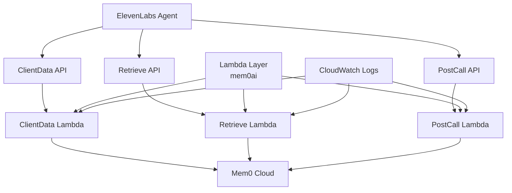

# AgenticMemory

**Production-Ready AWS Serverless Backend** for ElevenLabs Voice Agents with Mem0 Cloud integration for conversational memory management.

[](https://aws.amazon.com/serverless/sam/)
[](https://www.python.org/)
[](https://mem0.ai/)
[](https://elevenlabs.io/)

## Overview

This system bridges **ElevenLabs voice agents** with **Mem0 Cloud** for persistent conversational memory across calls. Three optimized Lambda functions handle the complete memory lifecycle:

1. **ClientData** (Pre-call): Returns personalized memory context when conversation starts
2. **Retrieve** (Mid-call): Semantic search for agent tools during active conversations  
3. **PostCall** (Async): Stores factual and semantic memories after call completion

**✨ Key Features:**
- 🚀 **Sub-500ms latency** with separate HTTP APIs per function
- 🔐 **Production security** with HMAC signatures and workspace key auth
- 🧠 **Smart memory separation** between factual data and conversation context
- 📊 **Real-time monitoring** with CloudWatch integration
- 🔄 **Async processing** to prevent webhook timeouts
- ⚡ **Optimized performance** with Lambda layer reuse

## 📁 Project Structure

```
AgenticMemory/
├── src/                    # Lambda function source code
│   ├── client_data/        # Pre-call memory retrieval
│   ├── retrieve/           # Mid-call semantic search
│   └── post_call/          # Async memory storage
├── layer/                  # Shared Lambda layer (mem0ai)
├── docs/                   # 📚 All documentation
│   ├── README.md           # Documentation index
│   ├── SPECIFICATION.md    # Technical spec
│   ├── SYSTEM_FLOW.md      # Architecture diagrams
│   ├── ELEVENLABS_SETUP_GUIDE.md
│   ├── QUICK_REFERENCE.md
│   └── ... (see docs/README.md)
├── scripts/                # 🧪 Test & utility scripts
│   ├── README.md           # Scripts index
│   ├── test_postcall_with_file.py  # ⭐ Main test tool
│   ├── test_postcall.sh    # Bash wrapper
│   └── ... (25+ test scripts)
├── test_data/              # 📋 JSON test payloads
│   ├── README.md           # Test data index
│   ├── conv_*.json         # Real conversation files
│   └── *_payload.json      # Sample payloads
├── tests/                  # Unit tests
├── template.yaml           # SAM deployment template
├── samconfig.toml          # SAM configuration (gitignored)
└── requirements.txt        # Dev dependencies
```

**Quick Navigation:**
- 📖 **Documentation**: See [docs/README.md](docs/README.md)
- 🧪 **Testing**: See [scripts/README.md](scripts/README.md)  
- 📊 **Test Data**: See [test_data/README.md](test_data/README.md)

## Architecture



**Infrastructure Components:**
- 🏗️ **3 Lambda Functions** (Python 3.12, 256MB memory)
- 🌐 **3 HTTP API Gateways** (separate for minimal routing latency)
- 📦 **1 Shared Lambda Layer** (mem0ai package for reuse)
- 📊 **CloudWatch Logs** (7-day retention for cost optimization)
- 🔧 **CloudFormation Stack** (Infrastructure as Code)

## Quick Start

### Prerequisites Checklist

- ✅ **AWS CLI** configured with appropriate credentials
- ✅ **SAM CLI** installed ([Installation Guide](https://docs.aws.amazon.com/serverless-application-model/latest/developerguide/install-sam-cli.html))
- ✅ **Python 3.12** installed
- ✅ **Mem0 Account** with API credentials:
  - API Key (starts with `mem0-...`)
  - Organization ID (starts with `org_...`) 
  - Project ID (starts with `proj_...`)
- ✅ **ElevenLabs Account** with webhook credentials:
  - Workspace Secret Key (starts with `wsec_...`)
  - HMAC Signing Key (for webhook verification)

## Project Structure

```
AgenticMemory/
├── 📄 SPECIFICATION.md           # Complete system specification
├── 📖 README.md                  # Project documentation (this file)
├── 🏗️ template.yaml              # SAM CloudFormation template
├── 📋 requirements.txt           # Development dependencies
├── 🚫 .gitignore                 # Git ignore rules
├── 🤖 .github/
│   └── copilot-instructions.md   # AI coding assistant guidelines
├── 📦 layer/
│   └── requirements.txt          # Lambda layer dependencies (mem0ai)
├── 🧪 test_*.py                  # Authentication & webhook test scripts
└── 🔧 src/
    ├── client_data/
    │   └── handler.py            # Pre-call memory retrieval
    ├── retrieve/
    │   └── handler.py            # Mid-call semantic search
    └── post_call/
        └── handler.py            # Post-call memory storage
```

## ⚡ Deployment

> **💡 Tip**: The build process requires the Lambda layer to be built first since all functions depend on the shared mem0ai package.

### Step 1: Build the Lambda Layer

```bash
cd layer
mkdir -p python
pip install -r requirements.txt -t python/
cd ..
```

### Step 2: Build the SAM Application

```bash
sam build
```

### Step 3: Deploy to AWS

#### Option A: Guided Deployment (First Time - Recommended)

```bash
sam deploy --guided
```

**You'll be prompted for:**
- **Stack Name**: `sam-app` (or your preferred name)
- **AWS Region**: `us-east-1` (or your preferred region)
- **Parameters** (keep these secure!):
  ```
  Mem0ApiKey: mem0-1234...
  Mem0OrgId: org_abc123...
  Mem0ProjectId: proj_xyz789...
  ElevenLabsWorkspaceKey: wsec_def456...
  ElevenLabsHmacKey: your-hmac-signing-key
  ```
- **Confirm changes**: `Y`
- **Allow IAM role creation**: `Y` 
- **Save to samconfig.toml**: `Y` (saves parameters for future deployments)

#### Option B: Direct Deployment (With Parameters)

```bash
sam deploy \
  --stack-name sam-app \
  --region us-east-1 \
  --parameter-overrides \
    Mem0ApiKey=<your-key> \
    Mem0OrgId=<your-org> \
    Mem0ProjectId=<your-project> \
    ElevenLabsWorkspaceKey=<workspace-key> \
    ElevenLabsHmacKey=<hmac-key> \
  --capabilities CAPABILITY_IAM \
  --resolve-s3
```

### Step 4: Capture API Endpoints

After successful deployment, **save these URLs** for ElevenLabs configuration:

```bash
Outputs:
✅ ClientDataApiUrl: https://abc123.execute-api.us-east-1.amazonaws.com/Prod/client-data
✅ RetrieveApiUrl: https://def456.execute-api.us-east-1.amazonaws.com/Prod/retrieve  
✅ PostCallApiUrl: https://ghi789.execute-api.us-east-1.amazonaws.com/Prod/post-call
```

## 🔗 ElevenLabs Configuration

### 1. Conversation Initiation Webhook

**Purpose**: Pre-loads caller memory context when conversation starts

**ElevenLabs Agent Settings:**
- **Webhook URL**: `ClientDataApiUrl` from deployment outputs
- **Method**: POST
- **Headers**: 
  ```
  X-Workspace-Key: <your-workspace-key>
  Content-Type: application/json
  ```
- **Expected Response Format**:
  ```json
  {
    "type": "conversation_initiation_client_data",
    "dynamic_variables": {
      "caller_id": "+16129782029",
      "memory_count": "3", 
      "memory_summary": "Premium customer, prefers email updates",
      "returning_caller": "yes"
    },
    "conversation_config_override": {
      "agent": {
        "prompt": {
          "prompt": "Enhanced prompt with caller context..."
        }
      }
    }
  }
  ```

### 2. Agent Tool (Mid-Call Memory Search)

**Purpose**: Allows agent to search memories during conversation

**Add as Custom Tool in ElevenLabs:**
- **Tool Name**: `search_memory`
- **Description**: `Search caller's previous conversations and preferences`
- **URL**: `RetrieveApiUrl` from deployment outputs
- **Method**: POST
- **Parameters**:
  ```json
  {
    "type": "object",
    "properties": {
      "query": {
        "type": "string",
        "description": "What to search for in caller's memory"
      },
      "user_id": {
        "type": "string", 
        "description": "Caller's phone number"
      }
    },
    "required": ["query", "user_id"]
  }
  ```

### 3. Post-Call Webhook

**Purpose**: Automatically stores conversation memories after call ends

**ElevenLabs Webhook Settings:**
- **URL**: `PostCallApiUrl` from deployment outputs  
- **Method**: POST
- **Authentication**: HMAC Signature (automatically configured by ElevenLabs)
- **Timeout**: 30 seconds (webhook returns 200 immediately, processes async)

## 🧪 Testing & Validation

> **💡 Tip**: Use the included test scripts for comprehensive validation before going live.

### Authentication Tests

**Test Workspace Key Authentication:**
```bash
python3 test_clientdata.py
```

**Test HMAC Signature Validation:**
```bash
python3 test_postcall.py
```

### Manual API Testing

#### Test ClientData Endpoint (Conversation Initiation)

```bash
curl -X POST <ClientDataApiUrl> \
  -H "Content-Type: application/json" \
  -H "X-Workspace-Key: <your-workspace-key>" \
  -d '{
    "caller_id": "+16129782029"
  }'
```

**Expected Response:**
```json
{
  "type": "conversation_initiation_client_data",
  "dynamic_variables": {
    "caller_id": "+16129782029",
    "memory_count": "3",
    "memory_summary": "Premium customer, prefers email updates", 
    "returning_caller": "yes"
  }
}
```

#### Test Retrieve Endpoint (Memory Search)

```bash
curl -X POST <RetrieveApiUrl> \
  -H "Content-Type: application/json" \
  -d '{
    "query": "What are the user preferences?",
    "user_id": "+16129782029"
  }'
```

**Expected Response:**
```json
{
  "memories": [
    "User prefers email communication over phone calls",
    "Premium account holder since 2023", 
    "Interested in product updates for AI tools"
  ]
}
```

#### Test PostCall Endpoint (Memory Storage)

```bash
curl -X POST <PostCallApiUrl> \
  -H "Content-Type: application/json" \
  -H "ElevenLabs-Signature: t=<timestamp>,v0=<hmac_signature>" \
  -d '{
    "conversation_id": "conv-123",
    "agent_id": "agent-123",
    "call_duration": 120,
    "transcript": "Customer called asking about their account status...",
    "metadata": {
      "caller_id": "+16129782029"
    }
  }'
```

**Expected Response:**
```json
{
  "status": "ok"
}
```

## 📊 Monitoring & Observability

### Real-Time Log Monitoring

**Monitor all functions simultaneously:**
```bash
# Terminal 1 - ClientData (Pre-call)
aws logs tail /aws/lambda/AgenticMemoriesClientData --follow

# Terminal 2 - Retrieve (Mid-call) 
aws logs tail /aws/lambda/AgenticMemoriesRetrieve --follow

# Terminal 3 - PostCall (Post-call)
aws logs tail /aws/lambda/AgenticMemoriesPostCall --follow
```

### CloudWatch Metrics Dashboard

**Key Metrics to Monitor:**
- **Invocation Count**: Total requests per function
- **Error Rate**: 4xx/5xx responses 
- **Duration**: Response time percentiles (p50, p95, p99)
- **Cold Starts**: Function initialization time
- **Concurrent Executions**: Active Lambda instances

**Set up CloudWatch Alarms for:**
```bash
# High error rate (>5%)
aws cloudwatch put-metric-alarm \
  --alarm-name "AgenticMemory-HighErrorRate" \
  --metric-name "Errors" \
  --namespace "AWS/Lambda" \
  --statistic "Average" \
  --threshold 5 \
  --comparison-operator "GreaterThanThreshold"

# High latency (>2000ms)  
aws cloudwatch put-metric-alarm \
  --alarm-name "AgenticMemory-HighLatency" \
  --metric-name "Duration" \
  --namespace "AWS/Lambda" \
  --statistic "Average" \
  --threshold 2000
```

### Performance Benchmarks

**Expected Performance (Production):**
- **ClientData**: <500ms (including Mem0 API calls)
- **Retrieve**: <300ms (semantic search)  
- **PostCall**: <100ms (async processing)
- **Cold Start**: <3000ms (with Lambda layer)
- **Concurrent Capacity**: 10+ simultaneous calls

## 🔧 Operations & Maintenance

### Updating the Stack

**After making code changes:**
```bash
# Rebuild and redeploy
sam build && sam deploy

# For infrastructure changes only
sam deploy --no-execute-changeset  # Preview changes first
sam deploy --execute-changeset     # Apply changes
```

### Configuration Updates

**Update environment variables without redeployment:**
```bash
# Update a single environment variable
aws lambda update-function-configuration \
  --function-name AgenticMemoriesClientData \
  --environment "Variables={MEM0_SEARCH_LIMIT=5,MEM0_TIMEOUT=10}"
```

### Backup & Recovery

**Export stack template:**
```bash
aws cloudformation get-template \
  --stack-name sam-app \
  --query 'TemplateBody' > backup-template.json
```

**Export environment configuration:**
```bash
aws lambda get-function-configuration \
  --function-name AgenticMemoriesClientData \
  --query 'Environment' > backup-env.json
```

### Scaling Considerations

**For higher traffic (>10 concurrent calls):**

1. **Add Provisioned Concurrency** in `template.yaml`:
   ```yaml
   ProvisionedConcurrencyConfig:
     ProvisionedConcurrencyEnabled: true
     ProvisionedConcurrency: 5
   ```

2. **Increase Memory** for better performance:
   ```yaml
   MemorySize: 512  # Up from 256MB
   ```

3. **Add API Throttling**:
   ```yaml
   ThrottleSettings:
     BurstLimit: 100
     RateLimit: 50
   ```

### Deleting the Stack

**Complete cleanup (removes all resources):**
```bash
aws cloudformation delete-stack --stack-name sam-app

# Verify deletion
aws cloudformation describe-stacks --stack-name sam-app
```

> **⚠️ Warning**: This permanently deletes all Lambda functions, APIs, and logs. Ensure you have backups of any important data.

## Environment Variables

All Lambdas use these environment variables (configured in template.yaml):

| Variable | Description | Default |
|----------|-------------|---------|
| `MEM0_API_KEY` | Mem0 API key | Required |
| `MEM0_ORG_ID` | Mem0 organization ID | Required |
| `MEM0_PROJECT_ID` | Mem0 project ID | Required |
| `MEM0_DIR` | Directory for Mem0 cache | `/tmp/.mem0` |
| `MEM0_SEARCH_LIMIT` | Max results for semantic search | `3` |
| `MEM0_TIMEOUT` | Timeout in seconds | `5` |
| `ELEVENLABS_WORKSPACE_KEY` | Workspace secret for auth | Required |
| `ELEVENLABS_HMAC_KEY` | HMAC signing key | Required |

## 💰 Cost Optimization

### Monthly Cost Estimate

**For 10 concurrent calls, ~10K invocations/month:**

| Service | Usage | Cost |
|---------|-------|------|
| **Lambda Compute** | 10K invocations × 500ms avg | $5-8 |
| **Lambda Requests** | 10K requests | $0.20 |
| **HTTP API Gateway** | 10K requests | $1-2 |
| **CloudWatch Logs** | 100MB/month (7-day retention) | $0.50 |
| **Data Transfer** | Minimal (JSON responses) | $0.10 |
| **Total** | | **~$7-11/month** |

### Cost Optimization Tips

💡 **Reduce Cold Starts**: Use Provisioned Concurrency for predictable traffic  
💡 **Optimize Memory**: Monitor actual usage and adjust MemorySize accordingly  
💡 **Log Retention**: 7-day retention vs 30-day saves ~60% on CloudWatch costs  
💡 **Efficient Packaging**: Lambda layer reduces deployment package size  
💡 **Regional Deployment**: Deploy in same region as ElevenLabs for lower latency/costs  

### Usage-Based Scaling

| Monthly Calls | Lambda Cost | API Gateway | Total Est. |
|---------------|-------------|-------------|------------|
| 1K calls | $1-2 | $0.10 | **$1-3** |
| 10K calls | $5-8 | $1-2 | **$7-11** |
| 100K calls | $40-60 | $10-15 | **$50-75** |
| 1M calls | $350-500 | $100-150 | **$450-650** |

> **Note**: Costs may vary based on memory usage, execution time, and AWS region.

## 🐛 Troubleshooting Guide

### Common Issues & Solutions

#### 🔴 Lambda Timeout Errors

**Symptoms**: 502 Bad Gateway, timeout errors in logs  
**Solution**: Increase timeout in `template.yaml`:
```yaml
Properties:
  Timeout: 30  # Increase to 45 or 60 seconds
```

#### 🔴 Mem0 Connection Issues

**Symptoms**: "Connection refused", "API key invalid"  
**Diagnostics**:
```bash
# Verify environment variables
aws lambda get-function-configuration \
  --function-name AgenticMemoriesClientData \
  --query 'Environment.Variables'
```
**Solution**: Ensure API credentials are correct in CloudFormation parameters

#### 🔴 HMAC Validation Failing

**Symptoms**: "Invalid HMAC signature" in PostCall logs  
**Solution**: 
1. Verify `ELEVENLABS_HMAC_KEY` matches ElevenLabs webhook settings
2. Check timestamp drift (must be within 30 minutes)
3. Ensure ElevenLabs is sending proper signature format: `t=timestamp,v0=hash`

#### 🔴 404 Not Found Errors

**Symptoms**: API Gateway returns 404  
**Solution**: 
1. Verify API Gateway URLs from deployment outputs
2. Check if stack deployed successfully: `aws cloudformation describe-stacks`
3. Ensure HTTP method is POST, not GET

#### 🔴 Cold Start Latency

**Symptoms**: First requests take 3-5 seconds  
**Solutions**:
1. **Immediate**: Accept cold starts as normal
2. **Short-term**: Add warming strategy (scheduled invocations)
3. **Long-term**: Add Provisioned Concurrency (increases cost)

#### 🔴 High Memory Usage

**Symptoms**: Lambda out of memory errors  
**Solution**: Increase MemorySize in `template.yaml`:
```yaml
Properties:
  MemorySize: 512  # Up from 256MB
```

### Debug Mode

**Enable verbose logging** by setting environment variable:
```bash
aws lambda update-function-configuration \
  --function-name AgenticMemoriesClientData \
  --environment "Variables={LOG_LEVEL=DEBUG}"
```

### Health Check Commands

**Quick system validation:**
```bash
# Test all endpoints
python3 test_clientdata.py
python3 test_postcall.py

# Check Lambda status
aws lambda list-functions --query 'Functions[?contains(FunctionName, `AgenticMemories`)].{Name:FunctionName,State:State}'

# Verify API Gateway health
aws apigatewayv2 get-apis --query 'Items[?contains(Name, `AgenticMemories`)].{Name:Name,State:ApiEndpoint}'
```

## Development

### Local Testing with SAM

```bash
# Invoke locally
sam local invoke AgenticMemoriesClientData -e events/client_data.json

# Start API locally
sam local start-api
```

### Running Tests

```bash
pip install -r requirements.txt
pytest tests/
```

## 🛡️ Security & Best Practices

### Authentication Summary

| Endpoint | Authentication Method | Header | Purpose |
|----------|----------------------|---------|---------|
| **ClientData** | Workspace Key | `X-Workspace-Key` | Prevents unauthorized memory access |
| **Retrieve** | None (trusted) | - | Direct agent tool calls (no auth needed) |
| **PostCall** | HMAC Signature | `ElevenLabs-Signature` | Validates webhook authenticity |

### Security Features

✅ **HTTPS Enforcement**: All API endpoints require HTTPS  
✅ **Signature Validation**: HMAC-SHA256 for webhook integrity  
✅ **Timestamp Checks**: 30-minute window prevents replay attacks  
✅ **IAM Least Privilege**: Lambda roles have minimal permissions  
✅ **Secret Management**: All sensitive values use CloudFormation NoEcho  
✅ **Input Validation**: Request payload validation and sanitization  

### Production Security Checklist

- [ ] **Rotate Keys Regularly**: Update HMAC and workspace keys quarterly
- [ ] **Monitor Failed Auths**: Set up CloudWatch alarms for 401/403 errors  
- [ ] **Enable AWS CloudTrail**: Log all API calls for audit trail
- [ ] **Use VPC Endpoints**: For enhanced network security (optional)
- [ ] **Implement Rate Limiting**: Add API Gateway throttling
- [ ] **Regular Security Reviews**: Audit IAM permissions and access patterns

### Environment Variables Security

All sensitive values are marked `NoEcho: true` in CloudFormation and never logged:

| Variable | Security Level | Notes |
|----------|---------------|-------|
| `MEM0_API_KEY` | 🔴 Sensitive | Never logged, encrypted at rest |
| `ELEVENLABS_WORKSPACE_KEY` | 🔴 Sensitive | Used for authentication |
| `ELEVENLABS_HMAC_KEY` | 🔴 Sensitive | Webhook signature validation |
| `MEM0_ORG_ID` | 🟡 Moderate | Organization identifier |
| `MEM0_PROJECT_ID` | 🟡 Moderate | Project identifier |

## 🚀 Roadmap & Future Enhancements

### Phase 2: Performance Optimization
- [ ] **Provisioned Concurrency**: Sub-100ms cold start elimination
- [ ] **Connection Pooling**: Reuse Mem0 connections across invocations  
- [ ] **Caching Layer**: Redis/ElastiCache for frequently accessed memories
- [ ] **Batch Processing**: Optimize multiple memory operations

### Phase 3: Advanced Features  
- [ ] **Memory Versioning**: Track memory changes over time
- [ ] **TTL Support**: Automatic memory expiration
- [ ] **Memory Categories**: Organize memories by type/importance
- [ ] **Conflict Resolution**: Handle duplicate/conflicting memories
- [ ] **Multi-tenant Support**: Separate memories by organization

### Phase 4: Monitoring & Ops
- [ ] **Dead Letter Queues**: Handle failed PostCall processing  
- [ ] **X-Ray Tracing**: Distributed request tracing
- [ ] **Custom Metrics**: Business-specific monitoring
- [ ] **A/B Testing**: Memory strategy optimization
- [ ] **Automated Alerts**: Proactive issue detection

### Phase 5: Integration Expansion
- [ ] **Multi-Provider Support**: Support for other voice AI platforms
- [ ] **Webhook Replay**: Retry failed memory operations
- [ ] **API Versioning**: Backward compatibility management
- [ ] **GraphQL Interface**: Advanced query capabilities
- [ ] **Real-time Updates**: WebSocket memory synchronization

## 📚 Additional Resources

### Documentation
- 📖 **[Complete System Specification](./SPECIFICATION.md)** - Detailed technical specification
- 🤖 **[GitHub Copilot Instructions](./.github/copilot-instructions.md)** - AI coding guidelines
- 🧪 **[Test Scripts](./test_*.py)** - Authentication and integration tests

### External Documentation  
- 🧠 **[Mem0 API Documentation](https://docs.mem0.ai/)** - Memory platform integration
- 🎙️ **[ElevenLabs Agent Docs](https://elevenlabs.io/docs/conversational-ai)** - Voice AI platform
- ⚡ **[AWS SAM Documentation](https://docs.aws.amazon.com/serverless-application-model/)** - Serverless framework
- 🐍 **[AWS Lambda Python Runtime](https://docs.aws.amazon.com/lambda/latest/dg/lambda-python.html)** - Runtime documentation

### Community & Support
- 💬 **[ElevenLabs Discord](https://discord.gg/elevenlabs)** - Community support
- 🛠️ **[AWS SAM GitHub](https://github.com/aws/serverless-application-model)** - Framework issues
- 📊 **[Mem0 GitHub](https://github.com/mem0ai/mem0)** - Memory platform issues

### Related Projects
- 🔗 **[ElevenLabs Examples](https://github.com/elevenlabs/elevenlabs-examples)** - Official examples
- 🔗 **[AWS SAM Examples](https://github.com/aws/serverless-application-model/tree/develop/examples)** - Serverless patterns
- 🔗 **[Mem0 Examples](https://github.com/mem0ai/mem0/tree/main/examples)** - Memory integration examples

---

## 📄 License

**MIT License** - See [LICENSE](./LICENSE) file for details.

## 🤝 Contributing

1. **Fork** the repository
2. **Create** a feature branch (`git checkout -b feature/amazing-feature`)
3. **Commit** your changes (`git commit -m 'Add amazing feature'`)
4. **Push** to the branch (`git push origin feature/amazing-feature`)
5. **Open** a Pull Request

## 📧 Support & Contact

For technical issues:
- 📋 **Check**: [SPECIFICATION.md](./SPECIFICATION.md) for detailed documentation  
- 🧪 **Run**: Test scripts to validate your setup
- 📊 **Monitor**: CloudWatch logs for error details
- 🐛 **Report**: Issues via GitHub Issues

---

**Built with ❤️ for the voice AI community**

*AgenticMemory bridges the gap between conversational AI and persistent memory, enabling truly personalized voice experiences.*